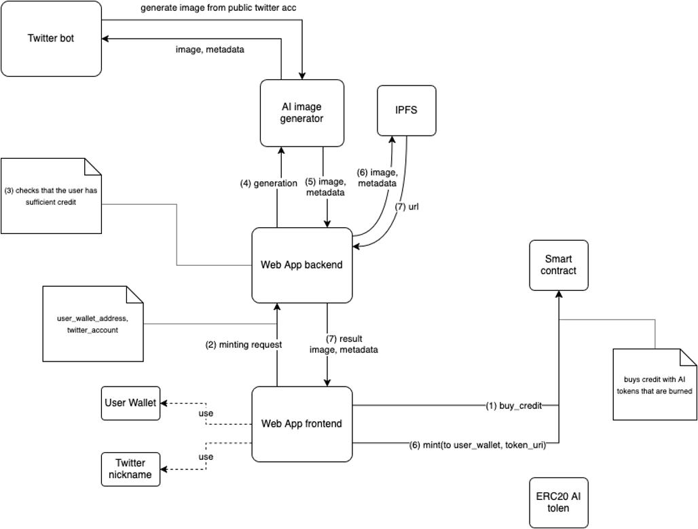

# Guizia

Guizia is a demo project that generates on-demand NFTs using AI, following graphic standards with minimal human intervention. It creates personalized NFT raccoons based on a personality determined from a user's Twitter activity.

## Overview

Guizia leverages AI-powered image generation and blockchain technology to mint NFTs. Users can request an NFT generation through their Twitter activity, and the system will analyze their personality to generate a unique raccoon-themed NFT. The NFTs are then minted on the blockchain and stored using decentralized storage.

### Main Features
- **AI-Generated NFTs**: Personalized NFT raccoons based on Twitter activity analysis.
- **Smart Contract Integration**: Uses ERC-20 AI tokens for purchasing credits and minting NFTs.
- **Decentralized Storage**: Metadata and images are stored on IPFS.
- **Minimal Human Intervention**: Fully automated process from analysis to NFT minting.
- **Twitter Bot Integration**: Generates images from public Twitter accounts.

## Repository Structure
The repository consists of three main components:

### 1. `guizia-twitter-bot`
Handles interactions with Twitter, regularly post AI generated image using the generator service and interact.

### 2. `guizia-webapp`
A web application that allows users to manage their wallets, request NFT minting, and view generated NFTs.

### 3. `guizia-generator-service`
An AI-powered service that processes Twitter activity data and generates unique raccoon-based NFTs.

## System Architecture
Guizia follows a structured flow for NFT generation, as illustrated in the `main_architecture.png` file:

1. **User Buys Credit**: Users purchase credits using ERC-20 tokens, which are burned upon transaction.
2. **Minting Request**: The user submits a request for NFT generation via the web app.
3. **Credit Verification**: The system checks if the user has enough credit.
4. **AI Image Generation**: The AI model generates an image based on Twitter activity.
5. **Metadata Creation**: The generated image and metadata are prepared.
6. **Storage on IPFS**: The image and metadata are uploaded to IPFS.
7. **NFT Minting**: The smart contract mints the NFT and assigns it to the user's wallet.

## Getting Started
Each component in this repository has its own README with setup instructions. Please refer to the respective folders for detailed installation and configuration steps.

