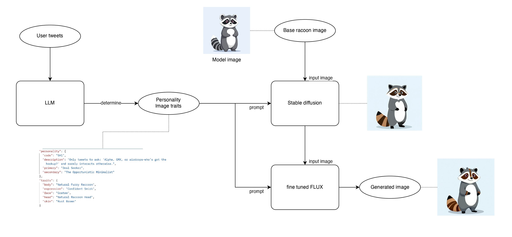
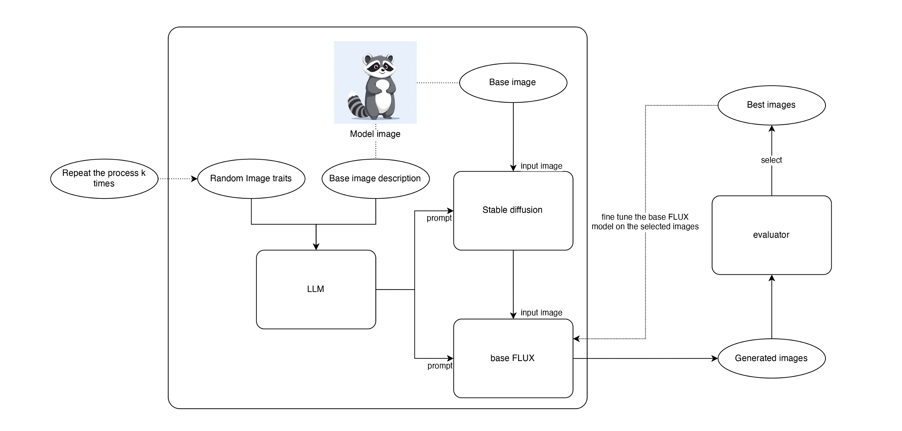

# Guizia Generator Service

## Project Description

Guizia Generator Service is a web service that generates personalized raccoon images based on a user's Twitter profile. This service leverages GPT-4 for text processing, stable diffusion and FLUX for image generation.

## Project Structure

```
guizia-generator-service/
├── .dockerignore
├── .env.exemple
├── .gitignore
├── .pylintrc
├── Dockerfile
├── Pipfile
├── README.md
├── docker_start.sh
├── pyproject.toml
├── src/
│   ├── app/
│   │   ├── __init__.py
│   │   ├── middleware/
│   │   │   ├── __init__.py
│   │   │   └── auth.py
│   │   ├── routes/
│   │   │   ├── __init__.py
│   │   │   ├── gen_image_personality.py
│   │   │   └── health.py
│   └── index.py
├── tests/
│   └── __init__.py
└── .vscode/
    ├── extensions.json
    ├── launch.json
    └── settings.json
```

## Dependencies

### System Dependencies

- Docker
- Python 3.12

## Installation

### Clone the Repository

```sh
git clone https://github.com/yourusername/guizia-generator-service.git
cd guizia-generator-service
```

### Install Python Dependencies

Using Poetry:

```sh
pip install poetry
poetry install
```

## Running the Server

### Using Docker

Build and run the Docker container:

```sh
./docker_start.sh
```

### Using Python

Run the Flask application:

```sh
export FLASK_APP=src/index.py
flask run --host=0.0.0.0 --port=7777
```

## Environment Variables

Create a `.env` file in the root directory and add your environment variables as shown in `.env.exemple`.

## Executing Dev Commands

To execute the development commands defined in the `tool.taskipy.tasks` section, you can use the `task` command followed by the task name. For example:

- To run the tests:
    ```sh
    poetry run task test
    ```

- To run the linter:
    ```sh
    poetry run task lint
    ```

- To run Pylint:
    ```sh
    poetry run task lint_pylint
    ```

- To run MyPy:
    ```sh
    poetry run task lint_mypy
    ```

- To run the post-test tasks:
    ```sh
    poetry run task post_test
    ```

## How the image generation works

### Explanations
This image generator service follows a structured process to create unique NFT images based on a user's Twitter activity. Here’s a breakdown of how it works:

1. **Personality Analysis from Tweets:**  
   - The system uses a Large Language Model (LLM) to analyze a user's tweets.  
   - Based on the tweet content, the model determines the user’s personality from a predefined set of possible personalities.

2. **Assigning Traits Based on Personality:**  
   - Each personality type corresponds to a set of potential visual traits (e.g., body type, facial expression, skin color).  
   - Traits are assigned randomly, with some traits being rarer than others, making some NFT variations more unique and valuable.

3. **Initial Image Generation Using Stable Diffusion:**  
   - A base raccoon image is used as a starting point.  
   - The system feeds the selected traits and the base image into a Stable Diffusion model.  
   - This generates a first version of the image incorporating the assigned traits.

4. **Final Refinement with Fine-Tuned FLUX Model:**  
   - The initial image is further refined using a FLUX model that has been fine-tuned specifically for high-quality and consistent image output.  
   - This step ensures smooth details and a polished, NFT-ready final image.

5. **Image and Metadata Output:**  
   - The final generated image, along with its corresponding metadata (personality type and assigned traits), is returned to the user.  
   - This metadata ensures uniqueness and provenance, essential for NFT applications.

This structured pipeline allows for personalized, rare, and high-quality NFT image generation in an automated manner.

### Image generation process


### Model fine tuning process


